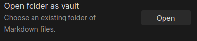
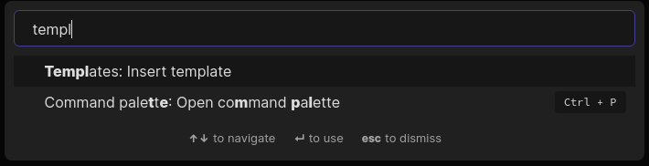

# Obsidian PARA

[View on Medium](https://b-yarbrough.medium.com/obsidian-and-para-are-the-perfect-pairing-together-you-can-remember-connect-and-create-7a87c8882de5)

Obsidian and PARA are the perfect pairing. Together, you can Remember, Connect, and Create. It is a universal organization system, designed to keep your knowledge approachable and actionable.

With Obsidian and PARA, you keep all of your information in plaintext files, and the entire hierarchy is four categories wide (projects, areas, resources, archives), and no more than four levels deep (Obsidian > vault > folders > notes).

You download the Obsidian PARA starter kit [here](https://github.com/byarbrough/obsidian-para/archive/refs/heads/main.zip) or with git.

## What is PARA

> [P.A.R.A.](https://fortelabs.co/blog/para/) stands for Projects — Areas — Resources — Archives, the four top-level categories that encompass every type of information you might encounter in your work and life. It was designed by Tiago Forte to be a universal organization system.

Each of the four folders is actionable. Projects contain discrete goals with specified time horizons, while Archives may sit dormant for months.

There is only ever one folder below each of these four PARA folders! This way you never can remember where things are, rather than drilling down though umpteen layers.

A **project** is “a series of tasks linked to a goal, with a deadline.”

Examples include: Complete app mockup; Develop project plan; Execute business development campaign; Write blog post; Finalize product specifications; Attend conference

An **area of responsibility** is “a sphere of activity with a standard to be maintained over time.”

Examples include: Health; Finances, Professional Development; Travel; Hobbies; Friends; Apartment; Car; Productivity; Direct reports; Product Development; Writing

A **resource** is “a topic or theme of ongoing interest.”

Examples include: habit formation; project management; transhumanism; coffee; music; gardening; online marketing; SEO; interior design; architecture; note-taking

**Archives** include “inactive items from the other three categories.”

Examples include: projects that have been completed or become inactive; areas that you are no longer committed to maintaining; resources that you are no longer interested in

### Progressive Summarization

PARA intends to enable you to **Remember**, **Connect**, and **Create**.

You should be able to capture ideas worth saving, opportunistically connect those ideas with other ideas, and then use your curated, layered knowledge base to create content you enjoy and is valuable.

You accomplish this via [Progressive Summarization](https://fortelabs.co/blog/progressive-summarization-a-practical-technique-for-designing-discoverable-notes). This is a strategy that answers the question, "How do I make what I’m consuming right now easily discoverable for my future self?”

The core of Progressive Summarization is that every time you interact with a note, you compress it just a little more. As you compress it, you loose some of the original context, but have the opportunity to connect it with other and new ideas.

For more information, see Forte's [Building a Second Brain Course](https://fortelabs.co/blog/basboverview/) and his [Progressive Summarization](https://fortelabs.co/blog/progressive-summarization-a-practical-technique-for-designing-discoverable-notes) post.

## Why Obsidian

> [Obsidian](https://obsidian.md/) is a powerful **knowledge base** on top of
a **local folder** of plain text Markdown files.

It is available for Windows, macOS, Linux, Android, and iPhone.

Here are the key features that make Obsidian the best choice for PARA:

1. **Tags and links are first-class.** The human brain is non-linear: we jump from idea to idea, all the time. Your second brain should work the same. Graph view allows you to explore links.
2. **Easily searchable.** You can instantly search all of your files to find phrases or keywords.
3. **Never worry about being locked-in.** Files are plain Markdown and stored locally. So if you ever decide to use a different editor, you don't need to hope that you'll be able to export them from a proprietary format.
4. **Beauty and simplicity**. The editor is simple, yet powerful, giving you more space for your thoughts and less for distractions. Plus, with extensible plugins, you can customize it to fit you.
5. **Sync across all your devices.** Seamless synchronization across your computers and mobile devices. The files are encrypted, so only you can read them.

## How to use this repository

First, [download this repository](https://github.com/byarbrough/obsidian-para/archive/refs/heads/main.zip) and extract it to where you want your vault to be located.

Consider placing the folder in a location that is automatically backed up, such as to iCloud or GoogleDrive.

If using `git`, then change the `remote` to your repository before using the [obsidian-git](https://github.com/denolehov/obsidian-git) plugin (which doesn't work with Snaps, sadly)... if that was gibberish, then just delete the `.git/` hidden folder.

### Obsidian Setup

[Install Obsidian](https://obsidian.md/).

Open Obsidian and choose “Open folder as vault.”

Open this folder.

The settings for your vault are saved in the hidden folder `.obsidian/`. Currently, several core plugins are enabled. All community plugins and themes are disabled. You can change this in settings.

Purchasing and setting up [Obsidian Sync](https://obsidian.md/sync) is highly recommended if you are using Obsidian on multiple devices.

#### Templates

The `templates/` directory contains templates that can be used to standardize headers in your files.

To insert a template, create a new file, name it, and press `Ctrl + p`. Then begin typing "templates".

See the [Templates help](https://help.obsidian.md/Plugins/Templates) for more information.

### Migrate to PARA

1. Create a folder in `4. Archives` with today's date. Then move all of your existing folders as is with the same existing hierarchy (remember it's not deleted)
2. Create one folder for each of your current projects you’re working on in `1. Projects` (remember only one sub-folder to stay four levels deep)
3. Create a goal for each of those Projects. If you cannot come up with a goal for it right now, then consider if it should really be under `2. Areas`
4. If you already know some of your `2. Areas`, you can create the folders, but try not to have too many empty folders
5. Do not create any folders in `3. Resources`, yet. As you read or discover things, create a sub-folder and add notes.

Each time you go into `4. Archives` to take one of the "old" notes or files, you then move it to the right spot in the new taxonomy. Doing it this way will highlight the most used notes, and what's left behind can stay in Archive until it's finally used (or not).

Once you have the folder hierarchy done, you want to copy it across all your other systems; that is where P.A.R.A. starts to shine. You want to have the same hierarchy for your local files on your computer, in your notes, in your Dropbox/Google Drive/iCloud, and everywhere else you have to keep information. Doing that will make it very quick and easy to find things you might need for work or something in the same zone across all your apps. For this reason, the more system you integrate the taxonomy into, the easier finding things will be.

#### Setup tips

- If a note (or a file) can go into two different folders, you put it in the folder where you will **_most likely need it next_** since folders are based on actionability, and it will get moved anyway in the flow of things.
- You can also have the "same" folder in 2 different roots. For example, `2. Areas/Health` and `3. Resources/Health` the first one is **_your_** health notes and the other **general** health-related notes.
- Remember, you do **_not_** want to sort all your current notes and files and put them in the new folder, put them all in the Archive as is, and then move them out as you use them.
- You do **_not_** have to do every single folder for your local files and cloud service; create the sub-folders are you need them, **_but_** you need to have one complete setup, most likely in your notes, to act as the primary reference for the others.

You can also find a helpful thread on PARA in the Obsidian Forums.
